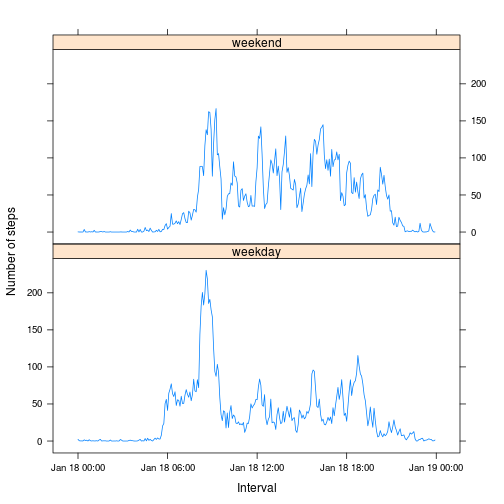
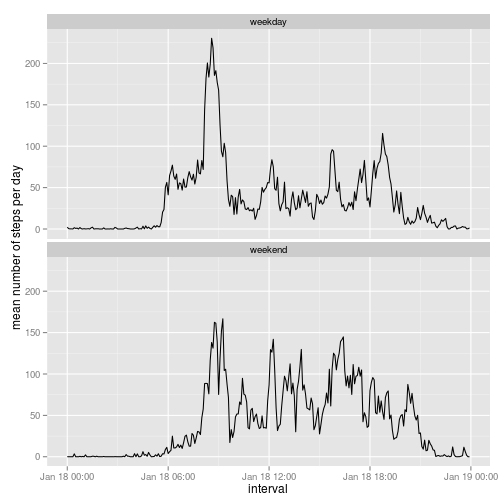

# Reproducible Research - Peer Asignment 1

The report below uses data from a personal activity monitoring device. This device collects data at 5 minute intervals through out the day. The data consists of two months of data from an anonymous individual collected during the months of October and November, 2012 and include the number of steps taken in 5 minute intervals each day.

To replicate the analisis make sure the file "activity.zip" is present in your working directory.

1. First I set the system language to english (I run a non-english system), and load necessary libraries. 
    
    ```r
    setwd()
    Sys.setlocale("LC_TIME", "en_US.UTF-8")
    library(knitr)
    library(lattice)
    ```
### Loading and preprocessing the data

2. I unzip the data set into the working directory and format the date and interval variables as Date class.
    
    ```r
    data <- read.csv(unzip("activity.zip"), header = TRUE)
    data$date <- as.Date(data$date)
    data$interval <- sprintf("%04d", data$interval)
    data$interval <- as.POSIXct(strptime(data$interval, format = "%H%M"))
    ```
### What is mean total number of steps taken per day?

3. For this part of the analisis I omit the rows with NA values on the data set. Then I proceed to calculate the total number of steps per day and plot an histogram of it. I then report the mean and median values.
    
    ```r
    data <- na.omit(data)
    sum_data <- aggregate(data$steps, by = list(data$date), FUN = sum)
    hist(sum_data$x,
         xlab = "Number of steps",
         main = "Number of steps per day")
    ```
    
    
    
    ```r
    mean(sum_data$x)
    ```
    
    ```
    ## [1] 10766.19
    ```
    
    ```r
    median(sum_data$x)
    ```
    
    ```
    ## [1] 10765
    ```
### What is the average daily activity pattern?

4. I calculate the average number of steps by time interval and plot a time series.
    
    ```r
    avg_activity <- aggregate(data$steps, by = list(data$interval), FUN = mean)
    colnames(avg_activity) <- c("interval", "steps")
    plot(avg_activity$interval, avg_activity$steps,
         xlab = "Interval",
         ylab = "Average number of steps",
         main = "Average Daily Activity",
         type = "l")
    ```
    
    
    
    To find the interval with the highest average activity I simply order the created data frame and print the first rows. We can see that the interval with highest activity is 8:35 in the morning, with an average of 206.17 steps.
    
    ```r
    avg_activity = avg_activity[order(avg_activity$steps, decreasing=TRUE),]
    head(avg_activity)
    ```
    
    ```
    ##                interval    steps
    ## 104 2015-01-18 08:35:00 206.1698
    ## 105 2015-01-18 08:40:00 195.9245
    ## 107 2015-01-18 08:50:00 183.3962
    ## 106 2015-01-18 08:45:00 179.5660
    ## 103 2015-01-18 08:30:00 177.3019
    ## 101 2015-01-18 08:20:00 171.1509
    ```
### Imputing missing values

5. For this part of the analisis I reload the data and format the time variables, but keeping the rows with NA values. We can see that these rows amount for a total of 2304.
    
    ```r
    data_na <- read.csv(unzip("activity.zip"), header = TRUE)
    data_na$date <- as.Date(data_na$date)
    data_na$interval <- sprintf("%04d", data_na$interval)
    data_na$interval <- as.POSIXct(strptime(data_na$interval, "%H%M"))
    sum(is.na(data_na))
    ```
    
    ```
    ## [1] 2304
    ```
6. To imput the missing values, I used the mean values calculated in step 4. I use the merge function to buil a data set with the average step values for all rows in the data set. Then I order the merged data frame by date so that it has the same order than the original data frame. Finnaly I replace the NA values on original data set with the average values of the same rows from the merged data frame.
    
    ```r
    merged_na <- merge(data_na, avg_activity, by = "interval")
    merged_na <- merged_na[order(merged_na$date),]
    data_na$steps[is.na(data_na$steps)] <- merged_na$steps.y[is.na(data_na$steps)]
    ```
7. I repeat the calculations for the total number of steps. We can see that imputing the NA values did not produce any significant differences in comparison with the data set with NAs. The frequency scale was increased (because there are more rows of data, that is, more counts), but the distribution of the number of steps remains the same. Also the mean and median values show no significant change.
    
    ```r
    sum_data_na <- aggregate(data_na$steps, by = list(data_na$date), FUN = sum)
    hist(sum_data_na$x,
         xlab = "number of steps",
         main = "Number of steps per day")
    ```
    
    
    
    ```r
    mean(sum_data_na$x)
    ```
    
    ```
    ## [1] 10766.19
    ```
    
    ```r
    median(sum_data_na$x)
    ```
    
    ```
    ## [1] 10766.19
    ```
### Are there differences in activity patterns between weekdays and weekends?

8. For the last part of the analisis I build a new factor variable that indicates if the day of the measurement is a weekday or weekend day.
    
    ```r
    data_na$weekday = ifelse (weekdays(data_na$date) == "Sunday" | weekdays(data_na$date) == "Saturday",1,0)
    data_na$weekday = factor(data_na$weekday, levels = c(0,1), labels = c("weekday","weekend"))
    ```
To produce the final plot I calculate the average number of steps by interval and by the factor variable "weekday". I then use the lattice library to plot the data using weekday as grouping variable. The plot shows that weekdays have the most activity during the first hours in the morning. Weekend days also show more activity in the morning, but the overall activity is more evenly distributed through out the day.
    
    ```r
    sum_data_week <- aggregate(data_na$steps, by = list(data_na$interval,data_na$weekday), FUN = mean)
    xyplot(data = sum_data_week, x ~ Group.1 | Group.2,
           type = "l",
           xlab = "Interval",
           ylab = "Number of steps",
        layout = c(1,2))
    ```
    
    
Another alternative is to use the ggplot package.
    
    ```r
    library(ggplot2)
    
    ggplot(sum_data_week, aes(x = Group.1, y = x)) +
            geom_line() +
            xlab("interval") + 
            ylab("mean number of steps per day") + 
            facet_wrap(~Group.2, nrow = 2)      
    ```
    
    
9. Finally I knit the final report to produce the the HTML file.
    
    ```r
    knit2html("PA1_template.Rmd")
    ```
